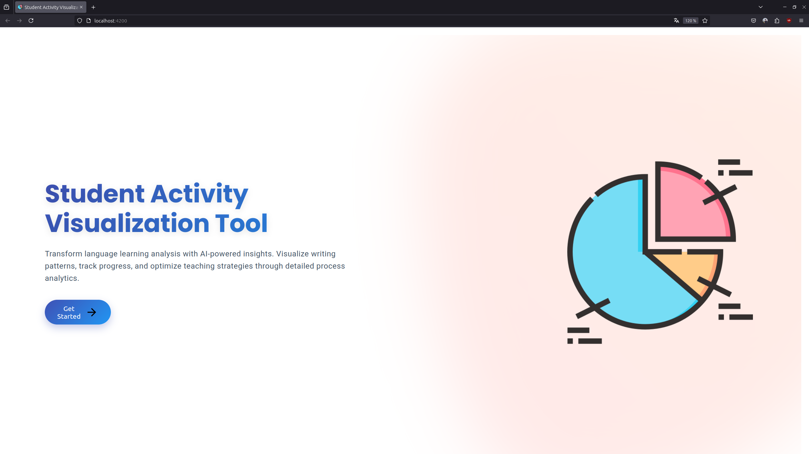

# Student Activity Visualization Tool



An Angular-based visualization tool that analyzes student activity data through interactive timelines and pie charts.

## Features

- 📊 **Dual Visualization**: View data as both timeline (xrange chart) and pie charts
- 🎨 **Color-coded Actions**: Consistent color scheme across visualizations
- 📁 **CSV Import**: Process multiple student files simultaneously
- 🔍 **Interactive Charts**: Zoomable timeline and detailed tooltips

## Installation

1. **Prerequisites**
   - Node.js (v14+)
   - npm (v6+)
   - Angular CLI (`npm install -g @angular/cli`)

2. **Clone Repository**
    ```bash
    git clone https://github.com/NiNejah/action-time-line.git
    cd action-time-line
    ```

3. **Install Dependencies**
    ```bash
    npm install
    ```

4. **Run Application**
    ```bash
    npm start or ng serve --open
    ```

## Data Preparation

### CSV Format Requirements

* **File Naming Convention:**
  * [student-name]-SANS.csv
  * [student-name]-AVEC.csv 

* **File Content:**
```csv
temps,description
00:01:30,Cop-txt-trad
00:00:45,frappe
00:00:15,pause
```

## Usage 

1. **Upload Files**
   * Click "Choose Files" and select student CSV files
   *  Files must follow naming convention
  
2. **Toggle Views**
    * Use checkboxes to show/hide:
      * 🥧 Pie Charts (Time distribution)
      * ⏳ Timeline (Chronological sequence)
  
3. **Interpret Results**
    * **Timeline:**
      * X-axis: Time progression
      * Y-axis: Before/After phases
      * Colors: Action types
    * **Pie Charts:**
      * Left: Before intervention
      * Right: After intervention
      * Percentage: Time allocation per action

4. **Interact with Charts**
    * **Timeline:**
      * Drag to zoom
      * Click bars for details
      * Use reset zoom button
    * **Pie Charts:**
      * Hover for time breakdown
      * Click slices to highlight